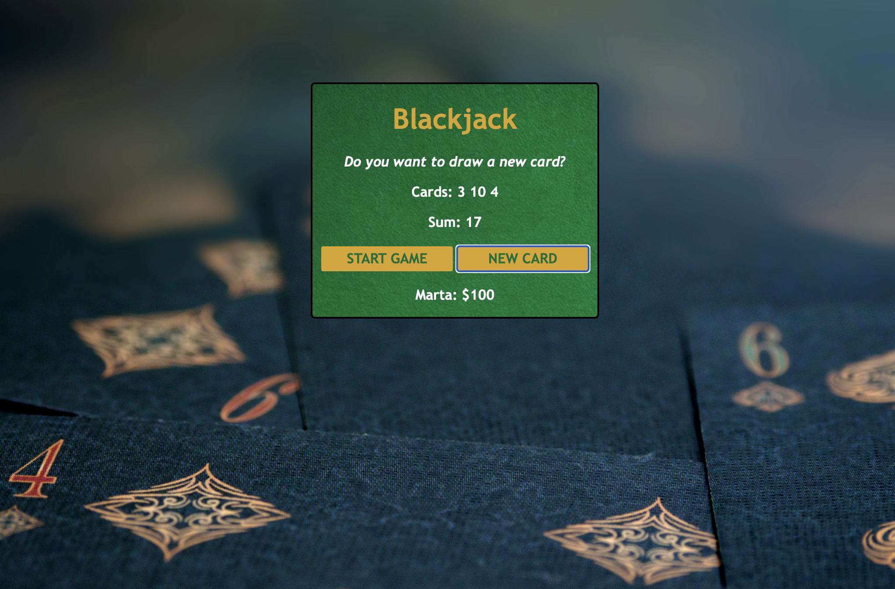

# blackjack-game

 ## Description

Blackjack is a classic casino game of luck and strategy. The object of the game is to win money by creating card totals higher than those of the dealer's hand but not exceeding 21, or by stopping at a total in the hope that the dealer will bust. On their turn, players choose to "hit" (take a card), "stand" (end their turn and stop without taking a card), "double" (double their wager, take a single card, and finish), "split" (if the two cards have the same value, separate them to make two hands), or "surrender" (give up a half-bet and retire from the game). Number cards count as their number, the jack, queen, and king ("face cards" or "pictures") count as 10, and aces count as either 1 or 11 according to the player's choice. If the total exceeds 21 points, it busts, and all bets on it immediately lose. 
 
 
This is simple, basic version of Blackjack and aces count as 11. In the next commits app will be developed, so "stand", "double" and "split" options become avaliable.

## Installation

Application is deployed in <a href="https://martamilewczyk.github.io/blackjack-game">Github</a>

## Usage

Application view

## Credits

<a href="https://www.freecodecamp.org/news">FreeCodeCamp</a>

Game <a href="https://en.wikipedia.org/wiki/Blackjack">description</a>

Photo by <a href="https://unsplash.com/@brett_jordan?utm_source=unsplash&utm_medium=referral&utm_content=creditCopyText">Brett Jordan</a> on <a href="https://unsplash.com/s/photos/gambling?utm_source=unsplash&utm_medium=referral&utm_content=creditCopyText">Unsplash</a>

## License
Project is licensed under the <a href="LICENSE">MIT License</a>.

---
